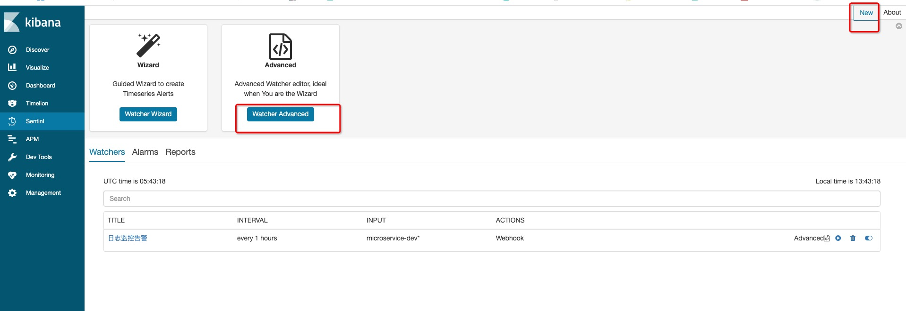
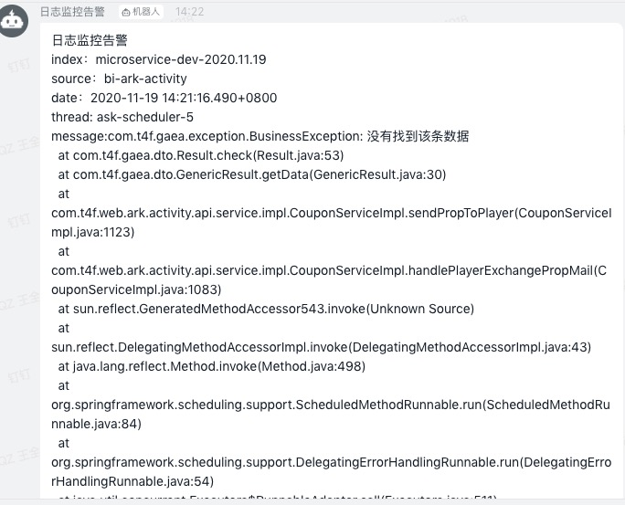

# elk学习

标签（空格分隔）： es

---

* [elk学习](#elk学习)
   * [elk搭建](#elk搭建)
      * [解压启动elasticsearch](#解压启动elasticsearch)
      * [解压启动logstash-5.6.3](#解压启动logstash-563)
      * [最后，启动kibana服务](#最后启动kibana服务)
   * [elk搭建优化](#elk搭建优化)
      * [es配置](#es配置)
      * [kibana配置](#kibana配置)
      * [logstash配置](#logstash配置)
      * [filebeat配置](#filebeat配置)
   * [Elasticsearch原理](#elasticsearch原理)
      * [倒排索引](#倒排索引)
      * [数据存储](#数据存储)
         * [分段存储](#分段存储)
         * [延迟刷新](#延迟刷新)
         * [段合并](#段合并)
      * [选主逻辑](#选主逻辑)
      * [数据存取](#数据存取)
   * [es高可用集群配置](#es高可用集群配置)
      * [es节点角色](#es节点角色)
         * [master](#master)
         * [data](#data)
         * [data_content](#data_content)
         * [data_hot](#data_hot)
         * [data_warm](#data_warm)
         * [data_cold](#data_cold)
         * [data_frozen](#data_frozen)
         * [ingest](#ingest)
         * [ml](#ml)
         * [remote_cluster_client](#remote_cluster_client)
         * [transform](#transform)
         * [默认角色](#默认角色)
         * [voting-only master-eligible](#voting-only-master-eligible)
      * [es数据分片](#es数据分片)
      * [小型es集群配置](#小型es集群配置)
         * [单节点集群](#单节点集群)
         * [双节点集群](#双节点集群)
         * [双节点集群（带voting-only节点）](#双节点集群带voting-only节点)
         * [三节点集群](#三节点集群)
         * [N节点集群](#n节点集群)
      * [大型es集群配置](#大型es集群配置)
         * [两个分区的集群](#两个分区的集群)
         * [两个分区的集群（带voting-only分区）](#两个分区的集群带voting-only分区)
         * [三个及以上分区的集群](#三个及以上分区的集群)
   * [es性能优化](#es性能优化)
      * [如何提高查询效率](#如何提高查询效率)
         * [Filesystem Cache](#filesystem-cache)
         * [堆硬件](#堆硬件)
         * [良好的文档模型](#良好的文档模型)
         * [尽可能的过滤查询结果](#尽可能的过滤查询结果)
         * [数据预热](#数据预热)
         * [分页性能优化](#分页性能优化)
         * [节点副本调优](#节点副本调优)
   * [kibana日志监控组件sentinl安装及使用](#kibana日志监控组件sentinl安装及使用)

## elk搭建

- https://www.ibm.com/developerworks/cn/opensource/os-cn-elk-filebeat/
- https://www.jianshu.com/p/0962fb50ecff

我们本次的目的是搭建一个单机版的elk日志收集分析可视化组建。如下图所示：
![此处输入图片的描述][1]

os：macOs 10.14.5 

elasticsearch-5.6.4.tar.gz       

kibana-5.2.0-darwin-x86_64.tar.gz

logstash-5.6.3.tar.gz

整体来说还是比较简单的，基本都是解压以后，直接启动就可以了。

### 解压启动elasticsearch

```linux
tar -zxvf elasticsearch-5.6.4.tar.gz

./elasticsearch-5.6.4/bin/elasticsearch
```

![此处输入图片的描述][2]

### 解压启动logstash-5.6.3
```linux
cd logstash-5.6.3/config/
vim logstash.conf

输入如下内容：
input {
     file {
        type => "log"
        path => "/Users/wangquanzhou/IdeaProjects/micro-service/log/*.log"
        start_position => "beginning"
    }
}
output {
  stdout {
   codec => rubydebug { }
  }
  elasticsearch {
    hosts => "127.0.0.1"
    index => "log-%{+YYYY.MM.dd}"
  }
}
```

然后启动应用，同样是bin下  ./logstash  启动

启动完成以后，logstash会去配置里指定的目录下收集所有的日志，如下图所示：
![此处输入图片的描述][3]

### 最后，启动kibana服务
```linux
tar -zxvf kibana-5.2.0-darwin-x86_64.tar.gz

./kibana-5.2.0-darwin-x86_64/bin/kibana
```
![此处输入图片的描述][4]

访问kibana的页面，http://localhost:5601，做如下配置：
![此处输入图片的描述][5]

然后就可以查看日志了：
![此处输入图片的描述][6]

## elk搭建优化

- https://www.elastic.co/guide/en/beats/filebeat/current/filebeat-overview.html#filebeat-overview
- https://souravatta.medium.com/monitor-jenkins-build-logs-using-elk-stack-697e13b78cb1

距离上一次写elk相关的内容已经有一段事件了，这次刚好需要再一次搭建一套elk系统，这次的目标是使用elk收集多台机器（有windows，有macos）上的jenkins job build日志。如下图所示：


这里介绍一下elk系统里filebeats和logstash的关系，二者的差异网上有很多[文章](https://www.zhihu.com/question/54058964)。其实，简答来说就是由于logstash对机器资源占用较多，不太经济，从而官方出了个新产品叫filebeats，他不是用来替代logstash的，而是为了更好的完善elk家族而出现的。

此次搭建选用的版本是`7.13.1`。

### es配置

由于es默认是集群模式，因此我们配置的时候需要配置如下信息（一个只有一个节点的集群）：
```yaml
node.name: node-1

# ---------------------------------- Network -----------------------------------
#
# By default Elasticsearch is only accessible on localhost. Set a different
# address here to expose this node on the network:
#
network.host: 0.0.0.0

cluster.initial_master_nodes: ["node-1"]
```

然后直接`./elasticsearch-7.13.1/bin/elasticsearch`启动，如果要后台启动的话，可以加`&`符号。

### kibana配置
然后启动kibana，修改配置文件为如下格式：
```yaml
# Specifies the address to which the Kibana server will bind. IP addresses and host names are both valid values.
# The default is 'localhost', which usually means remote machines will not be able to connect.
# To allow connections from remote users, set this parameter to a non-loopback address.
server.host: "your host ip"


# The URLs of the Elasticsearch instances to use for all your queries.
elasticsearch.hosts: ["http://your host ip:9200/"]
```

使用`./kibana-7.13.1-darwin-x86_64/bin/kibana`启动kibana服务。

### logstash配置
然后是logstash服务，修改`logstash-sample.conf`为如下格式：
```yaml
# Sample Logstash configuration for creating a simple
# Beats -> Logstash -> Elasticsearch pipeline.

input {
  beats {
    port => 5044
  }
}

filter {
    # 由于我所有的日志都使用同样的规则解析，因此这里指定`type`为任意
  if [type] =~ ".*" {
# set all messages from the jenkins log as type 'jenkins' and add the @message field.
          mutate {
              add_field => ["@message_type", "jenkins"]
              add_field => ["@message", "%{message}"]
          }
}
  }
# now that we have possibly-multiline events, we can clean them up.
  filter {
# munge the possibly-multiline messages into a single string
      mutate {
          join => ["@message", "\n"]
      }
# split @message into __date and __msg, and overwrite the @timestamp value.
      grok {
          match => [ "@message", "^(?<__date>%{MONTH} %{MONTHDAY}, %{YEAR} %{TIME} (AM|PM)) (?<__msg>.+)" ]
      }
      date {
          match  => [ "__date", "YYYY-MMM-dd  HH:mm:ss a"]
      }
# ...now some patterns to categorize specific event types...
# parse build completion messages, adding the jenkins_* fields and the 'build' tag
      grok {
          match => [ "@message", "(?<jenkins_job>\S+) #(?<jenkins_build_number>\d+) (?<__msg>.+): (?<jenkins_build_status>\w+)" ]
          tag_on_failure => []
          overwrite => true
          add_tag => ['build']
      }

   # convert build number from string to integer
   mutate {
                convert => ["jenkins_build_number", "integer"]
                }
# tag messages that come from the perforce SCM plugin (and associated classes)
      grok {
          match => [ "@message", "\.perforce\."]
          tag_on_failure => []
          add_tag => ['p4-plugin']
      }
# if we have extracted a short message string, replace @message with it now
      if [__msg] {
          mutate {
              replace => ["@message","%{__msg}"]
          }
      }
# convert @message back into an array of lines
      mutate {
          split => ["@message", "\n"]
      }
  }
# clean-up temporary fields and unwanted tags.
  filter {
      mutate {
          remove_field => [
              "message",
              "__msg",
              "__date",
              "dumps1",
              "plugin_command"
          ]
          remove_tag => [
              "multiline",
              "_grokparsefailure"
          ]
      }
  }

output {
  elasticsearch {
    hosts => ["http://host ip:9200"]
    action => "index"
    index => "%{type}-%{+YYYY.MM.dd}"
    #user => "elastic"
    #password => "changeme"
  }
}
```

使用`./logstash-7.13.1/bin/logstash -f ./logstash-7.13.1/config/logstash-sample.conf`命令启动logstash。

### filebeat配置
最后在各个需要收集日志的节点启动`filebeats`,这里需要配置`filebeat.yml`文件(主要配置`Filebeat inputs`里的内容)，如下所示:
```yaml
# ============================== Filebeat inputs ===============================

## 输入可以有多个
filebeat.inputs:

# Each - is an input. Most options can be set at the input level, so
# you can use different inputs for various configurations.
# Below are the input specific configurations.

- type: log

  # Change to true to enable this input configuration.
  enabled: true

  # Paths that should be crawled and fetched. Glob based paths.
  paths:
    - /Users/wangquanzhou/.jenkins/jobs/n34/builds/*/log
    #- c:\programdata\elasticsearch\logs\*
    # multiline.pattern: '^[a-zA-Z]+\s[0-9]{1,2},\s[0-9]{4}\s[0-9]{1,2}:[0-9]{1,2}:[0-9]{1,2}\s(?:AM|am|PM|pm)'
    # 匹配不是空格开头的行
  multiline.pattern: '^[^\s].*'
  multiline.negate: true
  multiline.match: after
  exclude_lines: '^(\t)*$\n'
  fields:
    # 这里的type和logstash里检测的tyepe是对应的
    type: mac-n34-xcode-build
```

使用`./filebeat-7.13.1-darwin-x86_64/filebeat -c ./filebeat-7.13.1-darwin-x86_64/filebeat.yml`启动。

最后在kibana上配置相应的index即可，这里不多赘述。


## Elasticsearch原理

参考链接：

 - https://www.jianshu.com/p/eaa59e966ec4
 - https://www.cnblogs.com/hzzhero/p/7000672.html
 

学习Elasticsearch原理，我觉得有以下几个方面需要注意：

 1. 倒排索引
 2. 数据存储
 3. 选主逻辑
 4. 数据存取

### 倒排索引

首先我们说是**倒排索引**：

它首先是一个索引，为了加快数据的查询效率。当我们在进行文档关键字搜索的时候，**常规**的做法是：从文档的开始直接检索该文档，效率较为低下。

**倒排索引**是这么做的：首先将文档进行分段存储，并且利用分词器将文档内容分成一个个的词条（Term：对英文来说，就是一个个的单词，对中文来说，一般是分词后的一个词）。分词的同时，需要记录该term出现在哪个文档，哪个位置，出现的频次等信息。最终，会将这些信息组成一个倒排索引，存在内存中。实际的文本文件是存储在磁盘上的。              当我们需要查询某个词（word）的时候，es回去索引文件中查询该词对应索引记录的信息，进而定位到word对应的文档位置的信息，从而得到结果。如果查询的是词组（sentence），同样的，es会去索引文件中查询sentence对应的索引记录，理论上会得到多个索引信息，求**交集**，定位sentence的最终位置，从而查询得到结果信息。

![此处输入图片的描述][7]
![此处输入图片的描述][8]

### 数据存储

接下来我么说一下es的**数据存储**：

#### 分段存储
 所谓分段存储，其实就是刚刚说的，需要被检索的文档，会被拆分成多个部分存储在磁盘上。在底层采用了分段的存储模式，使它在读写时几乎完全避免了锁的出现，大大提升了读写性能。段被写入到磁盘后会生成一个**提交点**，提交点是一个用来记录所有提交后段信息的文件。一个段一旦拥有了提交点，就说明这个段**只有读**的权限，**失去了写**的权限。相反，当段在内存中时，就只有写的权限，而不具备读数据的权限，意味着不能被检索。
#### 延迟刷新
所谓延迟刷新，就是新增的文本文档，不会立即存储到磁盘上，而是经过一定时间或者达到一定大小时才会刷新到磁盘上。我们也可以手动触发 Refresh，POST /_refresh 刷新所有索引，POST /nba/_refresh 刷新指定的索引。

为了避免丢失数据，Elasticsearch添加了**事务日志**(Translog，那Translog如何保证断电信息不丢失呢？我觉得其实它也是类似于固态硬盘这种的disk，写入速度要远高于机械disk)，事务日志记录了所有还没有持久化到磁盘的数据。
![此处输入图片的描述][9]

#### 段合并
由于自动刷新流程每秒会创建一个新的段，这样会导致短时间内的段数量暴增。而段数目太多会带来较大的麻烦。

每一个段都会消耗文件句柄、内存和 CPU 运行周期。更重要的是，每个搜索请求都必须轮流检查每个段然后合并查询结果，所以段越多，搜索也就越慢。
Elasticsearch 通过在后台定期进行段合并来解决这个问题。小的段被合并到大的段，然后这些大的段再被合并到更大的段。

段合并的时候会将那些旧的已删除文档从文件系统中清除。被删除的文档不会被拷贝到新的大段中。合并的过程中不会中断索引和搜索。

段合并在进行索引和搜索时会自动进行，合并进程选择一小部分大小相似的段，并且在后台将它们合并到更大的段中，这些段既可以是未提交的也可以是已提交的。

合并结束后老的段会被删除，新的段被 Flush到磁盘，同时写入一个包含新段且排除旧的和较小的段的新提交点，新的段被打开可以用来搜索。
段合并的计算量庞大， 而且还要吃掉大量磁盘 I/O，段合并会拖累写入速率，如果任其发展会影响搜索性能。
Elasticsearch 在默认情况下会对合并流程进行资源限制，所以搜索仍然有足够的资源很好地执行。

### 选主逻辑

然后我们在讨论一下es的**选主逻辑**：

es内部一般有两种角色，**master**节点和**data**节点和**coordinator**节点。master节点负责创建索引、删除索引、跟踪哪些节点是群集的一部分，并决定哪些分片分配给相关的节点、追踪集群中节点的状态等，稳定的主节点对集群的健康是非常重要的。data节点负责数据的存储和相关的操作，例如对数据进行增、删、改、查和聚合等操作，所以数据节点(Data 节点)对机器配置要求比较高，对 CPU、内存和 I/O 的消耗很大。因此一般我们不宜将master节点和data节点部署在一起。

虽然对节点做了角色区分，但是用户的请求可以发往任何一个节点，并由该节点负责分发请求、收集结果等操作，而不需要主节点转发。这种节点可称之为coordinator节点，协调节点是不需要指定和配置的，集群中的任何节点都可以充当协调节点的角色。

ES 内部是如何通过一个相同的设置 cluster.name 就能将不同的节点连接到同一个集群的?答案是 **Zen Discovery**。它提供单播和基于文件的发现，并且可以扩展为通过插件支持云环境和其他形式的发现。Zen Discovery 与其他模块集成，例如，节点之间的所有通信都使用 Transport 模块完成。节点使用发现机制通过 Ping 的方式查找其他节点。

Elasticsearch 默认被配置为使用单播发现，以防止节点无意中加入集群。只有在同一台机器上运行的节点才会自动组成集群。如果集群的节点运行在不同的机器上，使用单播，你可以为 Elasticsearch提供一些它应该去尝试连接的节点列表。
当一个节点联系到单播列表中的成员时，它就会得到整个集群所有节点的状态，然后它会联系 Master 节点，并加入集群。这意味着单播列表不需要包含集群中的所有节点， 它只是需要足够的节点，当一个新节点联系上其中一个并且说上话就可以了。

如果你使用 Master 候选节点作为单播列表，你只要列出三个就可以了。这个配置在 elasticsearch.yml 文件中：
```java
discovery.zen.ping.unicast.hosts: ["host1", "host2:port"] 
```
节点启动后先 Ping ，如果 discovery.zen.ping.unicast.hosts 有设置，则 Ping 设置中的 Host ，否则尝试 ping localhost 的几个端口。

Elasticsearch 支持同一个主机启动多个节点，Ping 的 Response 会包含该节点的基本信息以及该节点认为的 Master 节点。

选举开始，先从各节点认为的 Master 中选，规则很简单，按照 ID 的字典序排序，取第一个。如果各节点都没有认为的 Master ，则从所有节点中选择，规则同上。

这里有个限制条件就是 discovery.zen.minimum_master_nodes ，如果节点数达不到最小值的限制，则循环上述过程，直到节点数足够可以开始选举。
最后选举结果是肯定能选举出一个 Master ，如果只有一个 Local 节点那就选出的是自己。
如果当前节点是 Master ，则开始等待节点数达到 discovery.zen.minimum_master_nodes，然后提供服务。
如果当前节点不是 Master ，则尝试加入 Master 。Elasticsearch 将以上服务发现以及选主的流程叫做 Zen Discovery 。

由于它支持任意数目的集群( 1- N )，所以不能像 Zookeeper 那样限制节点必须是奇数，也就无法用投票的机制来选主，而是通过一个规则。

为了预防集群**脑裂**的问题发生，一般需要设置当集群一半以上的节点选出的master一致时，才能对外提供服务。

### 数据存取
- https://github.com/AudiVehicle/advanced-java/blob/master/docs/high-concurrency/es-write-query-search.md


## es高可用集群配置

- https://www.elastic.co/guide/en/elasticsearch/reference/current/high-availability-cluster-design.html

如果要一个es集群可以弹性扩容，至少需要满足以下三个条件：

* 至少3个可成为master的节点
- 每个[角色](https://github.com/AudiVehicle/learn/blob/master/source/elk%E5%AD%A6%E4%B9%A0.md#es%E8%8A%82%E7%82%B9%E8%A7%92%E8%89%B2)的节点都至少有2个
- 每个[分片](https://github.com/AudiVehicle/learn/blob/master/source/elk%E5%AD%A6%E4%B9%A0.md#es%E6%95%B0%E6%8D%AE%E5%88%86%E7%89%87)都至少有2个备份，一个给primary分片，一个给replica分片

### es节点角色

- https://www.elastic.co/guide/en/elasticsearch/reference/current/modules-node.html#node-ingest-node

我们可以通过修改`elasticsearch.yml`文件的`node.roles`配置来修改es节点在集群中的角色。如果我们没有指定这个配置的话，默认该节点是以下角色：

#### master
配置了`master`角色的节点可以通过选择，成为集群的主节点，从而实现控制集群，master节点一般负责一些轻量化的任务，比如创建、删除索引，集群节点感知，数据分片位置确定等功能。

#### data
顾名思义就是负责集群数据的存储，更新，搜索，聚合等功能的节点。这些节点都是IO、memory、CPU敏感型的，所以有必要对节点的这些指标进行监控，以便于在节点负载过高时进行扩容。注意：这个配置不可用和下面的`data_*`同时存在。

#### data_content
Content data nodes accommodate user-created content. They enable operations like CRUD, search and aggregations.

#### data_hot
Hot data nodes store time series data as it enters Elasticsearch. The hot tier must be fast for both reads and writes, and requires more hardware resources (such as SSD drives).

#### data_warm
Warm data nodes store indices that are no longer being regularly updated, but are still being queried. Query volume is usually at a lower frequency than it was while the index was in the hot tier. Less performant hardware can usually be used for nodes in this tier.

#### data_cold
Cold data nodes store read-only indices that are accessed less frequently. This tier uses less performant hardware and may leverage searchable snapshot indices to minimize the resources required.

#### data_frozen
The frozen tier stores partially mounted indices exclusively. We recommend you use dedicated nodes in the frozen tier.

#### ingest
具有这种配置的节点，可以在数据存入es索引前，对数据做一定的转换。一般来说，这种节点的负载较大，因为需要与`master`，`data`角色的节点分开。

#### ml
A node that has xpack.ml.enabled and the ml role.

#### remote_cluster_client
具有这个角色的节点，可以被当做远程客户端来使用。

#### transform
做数据转换用的节点。

#### 默认角色
默认情况下（此时`node.roles`是一个空数组），每个节点都是一个`coordinating`节点，他主要完成数据查询及聚合，扮演的是一个智能负载均衡器的角色。查询一般分为两个阶段，`scatter`和`gather`。`scatter`主要负责将查询指令分发到各个`data`节点去执行，`gather`主要负责将查询得到的数据进行聚合组装。

#### voting-only master-eligible
这种角色的节点，不会真正成为master节点，只是参与master的选举投票过程（简而言之：只有投票权，没有选举权）。要配置这种角色的节点，需要同时配置`master` and `voting_only`两种角色，例如：
```java
node.roles: [ master, voting_only ]
```
一个高可用集群需要确保至少有三个可成为`master`的节点，其中只允许有一个节点是`voting-only`角色的节点。由于`voting-only`节点只是负责投票，不参与选举，因此该节点的硬件配置可以稍微低一些。但是，包括`master-eligible`，`voting-only`在内的节点之间的网络需要确保低延迟、高可用，各节点的存储设备也要尽可能的快，因为具有这些角色的节点在集群状态更新中，占有重要地位。


如果我们设置了集群中某个节点承担某个角色，那么需要确保集群的其他节点也正确设置了相应的角色，以确保集群正常运转。

一些特殊的集群还有一些特殊的注意事项：

- Cross-cluster search and cross-cluster replication require the remote_cluster_client role.
- Stack Monitoring and ingest pipelines require the ingest role.
- Fleet, the Elastic Security app, and transforms require the transform role. The remote_cluster_client role is also required to use cross-cluster search with these features.
- Machine learning features, such as anomaly detection, require the ml role.


### es数据分片
- https://www.elastic.co/guide/en/elasticsearch/reference/current/scalability.html#scalability

es的索引实质上是由一个或者多个物理分片组成的，分片数据有两种类型：`primaries`和`replicas`，primary分片的个数在索引创建时就已经确定，replica分片的个数可以随时调整，且不会影响索引的相关操作及数据的查询。

在分片的大小与primary分片的个数上通常需要做一些权衡，因为分片太大集群数据的迁移就越久，primary分片的个数越多索引的维护就越麻烦。

二者的平衡，有一些基本性能参数可以参考：

- Aim to keep the average shard size between a few GB and a few tens of GB. For use cases with time-based data, it is common to see shards in the 20GB to 40GB range.
- Avoid the gazillion shards problem. The number of shards a node can hold is proportional to the available heap space. As a general rule, the number of shards per GB of heap space should be less than 20.


### 小型es集群配置

- https://www.elastic.co/guide/en/elasticsearch/reference/current/high-availability-cluster-small-clusters.html#high-availability-cluster-design-one-node

#### 单节点集群

单节点集群是不可能自愈的，如果节点宕机只能通过历史数据进行手动恢复。且需要设置` index.number_of_replicas`（primary分片的数量） 为0（默认为1），以便于集群保持`green status`。不建议生产使用。

#### 双节点集群

建议两个节点都是`data`节点，且设置其中一个节点不能成为`master`节点，即明确指定哪个节点是`master`节点，因为不这样的话，假如一个宕机，另外一个节点由于无法获得超过半数的投票也无法成为master，集群就会宕机。

连接集群的时候，也不应该只连接其中一个节点，最好使用负载均衡连接集群。不建议生产使用。

#### 双节点集群（带voting-only节点）

为了解决上面双节点集群的问题，我们可以在集群中再加入一个`voting-only`节点，该节点不处理具体的数据存储、查询，仅在集群选主时进行投票。

集群外部的任何请求都不应该发到`voting-only`节点上。

这种架构模式理论上是生产上可以实现集群自愈的最基本节点配置。

#### 三节点集群

可以自愈，生产可以使用。

#### N节点集群

当节点数量大于3的时候，我们就可以对集群各个节点进行一些定制化的设置了，比如某些节点指定为`data node`或者是`ingest node`等。

虽然节点的数量大于了3个，但是可以成为master节点的数量最好设置为3个，不要太多。因为多了以后，选主的过程会耗费更长的时间，甚至于在比较大的集群里，可以直接指定某几个节点为只负责master角色的相关任务，且外部的相关请求都不应该发送到这几个节点上。

### 大型es集群配置

涉及到大型es集群的配置，需要引入一个新的概念，`zone`（分区），可以理解为是一群公用硬件基础设施的节点，此时集群的自愈就不再以`node`为单位了，而是以`zone`为单位。

#### 两个分区的集群

这种情况下，需要注意每个分区的`master-eligible`节点的数量要不一致才行，避免两个zone一样多，导致选不出master。

这种集群配置，只允许`master-eligible`节点少的zone宕机，不允许`master-eligible`节点多的宕机。

#### 两个分区的集群（带voting-only分区）

为了解决上面的只能特定zone宕机的问题，我们通过增加一个只含有一个`voting-only`节点的zone，另外两个zone各有一个`master-eligible`节点的模式来进行配置。

#### 三个及以上分区的集群

跟[上面](https://github.com/AudiVehicle/learn/blob/master/source/elk%E5%AD%A6%E4%B9%A0.md#n%E8%8A%82%E7%82%B9%E9%9B%86%E7%BE%A4)一样，当分区数量超过三个时，`master-eligible`节点的数量也最好只设置为3个（可以选择三个zone，每个zone设置一个`master-eligible`节点）。


## es性能优化

 - https://cloud.tencent.com/developer/article/1156231

### 如何提高查询效率
- https://www.elastic.co/guide/en/elasticsearch/reference/7.13/tune-for-search-speed.html#_use_faster_hardware_2
- https://zhuanlan.zhihu.com/p/99718374

#### Filesystem Cache

es的查询严重依赖于`Filesystem Cache`，通常情况下，为了能够让查询更快，需要确保一半的内存容量都用来做`Filesystem Cache`，以便于es可以存储热点索引数据。

#### 堆硬件

对，你没有看错，有钱就是王道。该升级CPU升级CPU，该上SSD上SSD，不要怕。

#### 良好的文档模型

为了让查询的成本更低，那么数据存储进es的时候，结构设计就要合理，避免不必要的查询。
反例：
- join查询应极力避免，查询效率会慢上百倍
- nested查询会使查询速度下降几倍

#### 尽可能的过滤查询结果

也就是说，查询结构返回的数据越多，越慢。如果非要查询多个字段的内容，可以把他们合在一起存储。

#### 数据预热

人为的加载热点数据

#### 分页性能优化

- 使用游标

#### 节点副本调优

虽然，主分片只能有一个，但是副分片可以有多个。


 

## kibana日志监控组件sentinl安装及使用

1、下载与kibana版本一致的sentinl安装包，我这里下载的是sentinl-v6.3.0.zip
，下载地址https://github.com/lmangani/sentinl/releases

2、在kibana的docker容器宿主机新建目录
```linux
mkdir -p /data/kibana/package
mkdir -p /data/kibana/plugins
# 修改文件夹权限
chown -R 1000:1000 /data/kibana/package/
chown -R 1000:1000 /data/kibana/plugins
```

3、对kibana的启动docker命令增加volume映射，避免每次重启kibana都要重新安装和配置sentinl，我使用的stack方式启动的kibana，启动yml文件如下：
```json
version: '3'

services:
  kibana:
    image: docker.elastic.co/kibana/kibana:6.3.0
    ports:
      - "5601:5601"
    environment:
      - "ELASTICSEARCH_URL=http://172.20.90.123:9200"
    volumes:
      - "/data/kibana/package:/usr/share/kibana/data"
      - "/data/kibana/plugins:/opt/kibana/plugins"
    deploy:
      placement:
        constraints:
          - "node.labels.id == manager"
```

重启下kibana，使路径映射生效

4、进入kibana容器，进入到`/opt/kibana/bin/kibana-plugin`进行插件安装
```linux
/opt/kibana/bin/kibana-plugin install file:///usr/share/kibana/data/sentinl-v6.3.0.zip
```

5、重启kibana

6、为了发送钉钉机器人告警信息，需要在钉钉里面新建一个机器人，如下图所示


7、配置sentinl的watcher，配置好的json示例如下：


```json
{
  "actions": {
    "Webhook_484382e1-fffe-4e39-95fa-a5512ab9f552": {
      "name": "Webhook",
      "throttle_period": "1m",
      "webhook": {
        "priority": "low",
        "stateless": false,
        "method": "POST",
        "host": "oapi.dingtalk.com",
        "port": "443",
        "path": "/robot/send?access_token=bf2a03ef1d2971b163b9f751e26b14f92234acc5e0f9c3141ef905311bd76718",
        "body": " {\"msgtype\": \"text\", \"text\": { \"content\": \"{{watcher.title}} \nindex：{{payload.hits.hits.0._index}}\nsource：{{payload.hits.hits.0._source.system}}\ndate：{{payload.hits.hits.0._source.date}}\nthread: {{payload.hits.hits.0._source.thread}}\nmessage:{{payload.hits.hits.0._source.message}}\" } }",
        "params": {
          "watcher": "{{watcher.title}}",
          "index": "{{payload.hits.hits.0._index}}",
          "payload_count": "{{payload.hits.total}}"
        },
        "headers": {
          "Content-Type": "application/json"
        },
        "auth": "",
        "message": "hello",
        "use_https": true
      }
    }
  },
  "input": {
    "search": {
      "request": {
        "index": [
          "microservice-dev*"
        ],
        "body": {
          "query": {
            "bool": {
              "must": [
                {
                  "match": {
                    "level.keyword": "ERROR"
                  }
                },
                {
                  "range": {
                    "@timestamp": {
                      "gte": "now-5m",
                      "lte": "now",
                      "format": "epoch_millis"
                    }
                  }
                }
              ],
              "must_not": []
            }
          }
        }
      }
    }
  },
  "condition": {
    "script": {
      "script": "payload.hits.total >=1"
    }
  },
  "trigger": {
    "schedule": {
      "later": "every 1 hours"
    }
  },
  "disable": false,
  "report": false,
  "title": "日志监控告警",
  "wizard": {},
  "save_payload": true,
  "spy": false,
  "impersonate": false
}
```




 
 


  [1]: https://github.com/Audi-A7/learn/blob/master/source/image/elk/elk.png?raw=true
  [2]: https://github.com/Audi-A7/learn/blob/master/source/image/elk/elastic.png?raw=true
  [3]: https://github.com/Audi-A7/learn/blob/master/source/image/elk/logstash.png?raw=true
  [4]: https://github.com/Audi-A7/learn/blob/master/source/image/elk/kibana.png?raw=true
  [5]: https://github.com/Audi-A7/learn/blob/master/source/image/elk/kibana_config.png?raw=true
  [6]: https://github.com/Audi-A7/learn/blob/master/source/image/elk/kibana_front_page.png?raw=true
  [7]: https://github.com/Audi-A7/learn/blob/master/source/image/elk/es1.png?raw=true
  [8]: https://github.com/Audi-A7/learn/blob/master/source/image/elk/es2.png?raw=true
  [9]: https://github.com/Audi-A7/learn/blob/master/source/image/elk/es_translog.png?raw=true